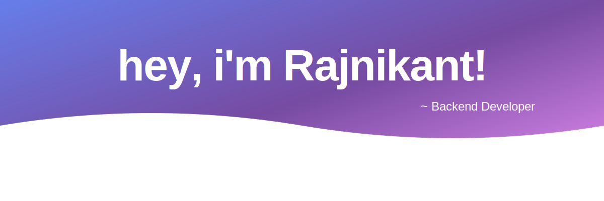

I'm a Java Backend Developer who is passionate about building scalable backend systems, designing microservice architectures, and continuously learning modern software engineering practices.My interest in distributed systems and backend engineering has led me to build production-grade applications, explore AI-powered search solutions, and contribute to projects that solve real-world problems.

Here's a list of things I currently keep myself busy with:


- Working as a **Java Backend Developer**
- Building backend applications using Java, Spring Boot and Spring ecosystem
- Exploring cloud technologies and deployment strategies
- Deep diving into distributed systems and system design
- Exploring AI to make work smarter, faster, and more efficient

Backend Toolkit

```text
Languages       → Java
Frameworks      → Spring Boot, Spring MVC, Spring Security
Databases       → MySQL, MariaDB, PostgreSQL
Messaging       → Kafka, RabbitMQ
Cloud & DevOps  → Docker, Kubernetes
Search          → Elasticsearch
Architecture    → Microservices, Event-Driven Systems
AI & LLMs       → Spring AI, Ollama, MCP, RAG, Tool Calling
Tools           → Git, Maven, IntelliJ IDEA
```

## Featured Projects

### E-Commerce 
A cloud-native e-commerce platform built using Spring Boot microservices, featuring product management, order processing, search, AI-powered recommendations, and centralized configuration.
Designed with industry-standard patterns such as service discovery, API gateway, event-driven communication, fault tolerance, and scalable distributed architecture.<br>
*https://github.com/rajni2209/e-commerce_spring_boot_microservice* 


### FilmFusion

Movie trivia and guessing game for film enthusiasts. Guess movies from clues, earn points, and challenge yourself across multiple genres and difficulty levels.

🔗 **Live Demo:** *https://filmfusion-kohl.vercel.app*

🔗 **Repository:** *[https://github.com/rajni2209/filmFusion](https://github.com/rajni2209/filmfusion_frontend)*

<br> 

### 📈 GitHub Stats


<hr>
<p align="center">
  <i>Let's connect and chat! Open to anything under the sun.</i>

  <p align="center">
    <a href="https://github.com/rajni2209"></a>
    <a href="https://www.linkedin.com/in/rajnikant--kumar/"></a>
    <a href="mailto:rajnikantkumar2209@gmail.com"></a>
  </p>
</p>


